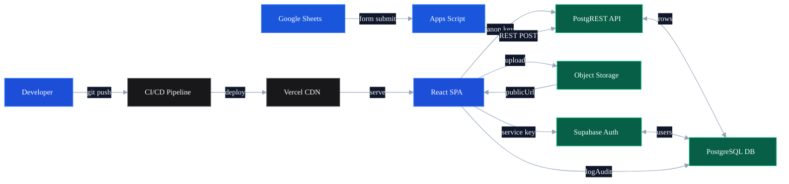
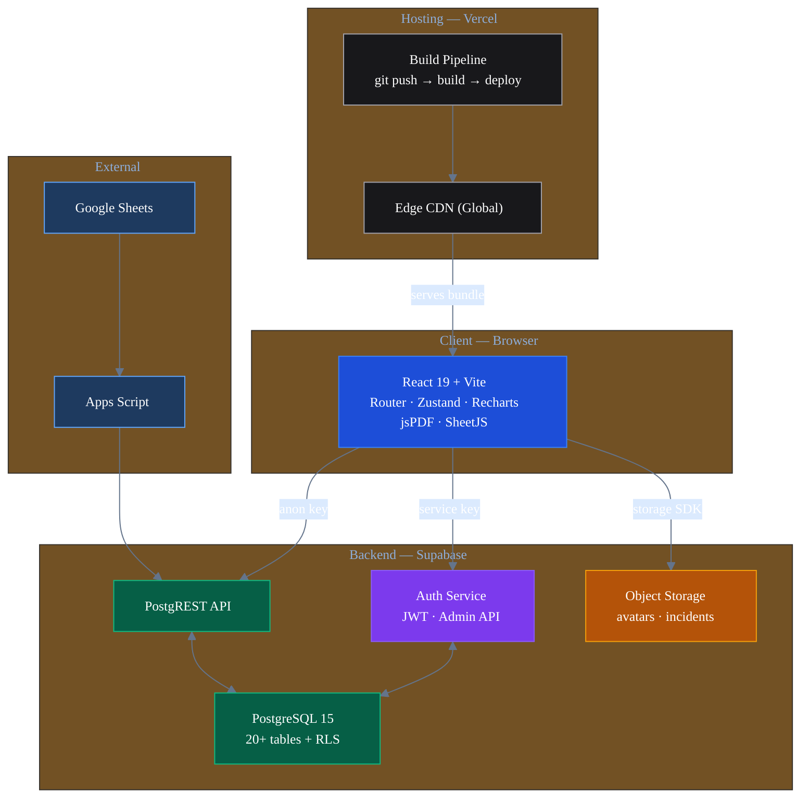
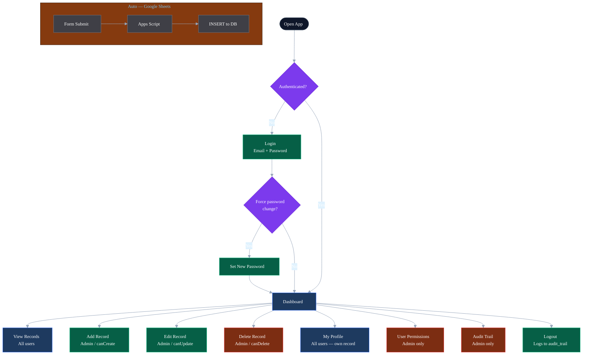

# CDRRMO System — Technical Diagrams

> Render at [mermaid.live](https://mermaid.live) or use the **Markdown Preview Mermaid Support** VS Code extension.

---

## 1. Entity Relationship Diagram (ERD)

> Key columns shown per table. Full schema in Supabase.

```mermaid
%%{init: {"theme": "base", "themeVariables": {"primaryColor": "#1e40af", "primaryTextColor": "#ffffff", "primaryBorderColor": "#3b82f6", "lineColor": "#3b82f6", "secondaryColor": "#dbeafe", "fontFamily": "Inter, sans-serif", "fontSize": "13px"}}}%%
classDiagram
  direction LR

  class auth_users {
    +UUID id
    +String email
    +JSON user_metadata
  }

  class employees {
    +UUID id
    +String employee_id
    +String name
    +String email
    +String role
    +String designation
    +String duty_status
    +String office
    +Date dob
    +String civil_status
    +String sex
    +String blood_type
    +String address
    +JSON work_experience
    +JSON trainings_attended
    +JSON children
    +String avatar_url
  }

  class user_permissions {
    +UUID id
    +UUID user_id
    +String module
    +Boolean can_create
    +Boolean can_read
    +Boolean can_update
    +Boolean can_delete
  }

  class incidents {
    +UUID id
    +String record_id
    +String team
    +Date date
    +String severity
    +String nature_of_incident
    +String place_of_incident
    +String name
    +Integer age
    +String vehicle
    +String helmet
    +String liquor
    +String action_given
    +Boolean refused_transfer
    +JSON photos
  }

  class vouchers {
    +UUID id
    +String record_id
    +String beneficiary_name
    +Numeric amount
    +String purpose
    +Date date
    +String status
    +Boolean has_insurance
  }

  class inventory {
    +UUID id
    +String record_id
    +String item_name
    +String category
    +Integer quantity
    +String condition
    +Date date_acquired
    +Boolean serviceable
    +JSON photos
  }

  class vehicles {
    +UUID id
    +String vehicle_id
    +String plate
    +String model
    +String type
    +String status
    +Date last_maintenance
  }

  class drivers {
    +UUID id
    +String driver_id
    +String name
    +String license_no
    +Date license_expiry
    +String status
  }

  class transport {
    +UUID id
    +String record_id
    +String vehicle
    +String driver
    +String destination
    +DateTime date_time
    +String purpose
    +JSON photos
  }

  class volunteers {
    +UUID id
    +String record_id
    +String volunteer_name
    +String organization
    +String accreditation_no
    +String status
    +Boolean with_insurance
  }

  class audit_logs {
    +UUID id
    +String user_email
    +String action
    +String module
    +String record_id
    +String details
    +DateTime created_at
  }

  class training_registrations {
    +UUID id
    +String record_id
    +String full_name
    +String gender
    +String contact_number
    +String[] trainings
    +Date birth_date
  }

  class drrm_office_training {
    +UUID id
    +String record_id
    +String first_name
    +String last_name
    +String office
    +String designation
    +Date birthdate
    +String photo_url
  }

  class client_satisfaction {
    +UUID id
    +String record_id
    +String client_name
    +Date date
    +Integer q1_timeliness
    +Integer q7_overall
    +String feedback
  }

  class cctv_documentations {
    +UUID id
    +String record_id
    +Date incident_date
    +String location
    +String status
    +JSON files
  }

  class venues {
    +UUID id
    +String record_id
    +String facility_name
    +Date date
    +Time start_time
    +Time end_time
    +String booked_by
  }

  class activities {
    +UUID id
    +String record_id
    +String activity_title
    +Date date
    +Integer participants
  }

  class documentations {
    +UUID id
    +String record_id
    +String title
    +Date date_filed
    +String document_type
    +JSON files
  }

  class calendar_events {
    +UUID id
    +String record_id
    +String event_title
    +Date start_date
    +Date end_date
    +String event_type
  }

  class cdrrmc_reso {
    +UUID id
    +String record_id
    +String resolution_no
    +String title
    +Date date_passed
    +JSON files
  }

  class cdrrmc_meeting {
    +UUID id
    +String record_id
    +String meeting_no
    +Date date
    +String agenda
    +JSON photos
  }

  %% Relationships
  auth_users       "1" --> "0..*" user_permissions     : has
  auth_users       "1" --> "0..1" employees            : linked via email
  auth_users       "1" --> "0..*" audit_logs           : generates
  transport        "0..*" --> "1" vehicles             : uses vehicle
  transport        "0..*" --> "1" drivers              : assigned driver
```

---

## 2. Data Flow Diagram (DFD)

---

## 3. System Architecture Diagram

---

## 4. Component Diagram

```mermaid
%%{init: {"theme": "base", "themeVariables": {"primaryColor": "#312e81", "primaryTextColor": "#ffffff", "primaryBorderColor": "#4f46e5", "lineColor": "#94a3b8", "secondaryColor": "#ede9fe", "fontFamily": "Inter, sans-serif", "fontSize": "13px"}}}%%
flowchart TD
  classDef root    fill:#1e1b4b,stroke:#4f46e5,color:#fff
  classDef layout  fill:#1e3a5f,stroke:#2563eb,color:#fff
  classDef page    fill:#064e3b,stroke:#10b981,color:#fff
  classDef shared  fill:#7c2d12,stroke:#ea580c,color:#fff
  classDef hook    fill:#4a1d96,stroke:#7c3aed,color:#fff
  classDef svc     fill:#374151,stroke:#9ca3af,color:#fff
  classDef util    fill:#1f2937,stroke:#6b7280,color:#fff

  APP["App.jsx"]:::root --> SB["Sidebar"]:::layout
  APP --> TB["Topbar"]:::layout
  APP --> PAGES

  subgraph PAGES["Pages"]
    direction TB
    DASH["Dashboard"]:::page
    EMP["Employees"]:::page
    INC["Incidents"]:::page
    DOC["Documentation"]:::page
    PERM["UserPermissions"]:::page
    OTHER["20+ Modules"]:::page
  end

  subgraph SHARED["Shared Components"]
    direction TB
    MODAL["Modal"]:::shared
    TOOLBAR["ModuleToolbar"]:::shared
    CROP["ImageCropper"]:::shared
    TOAST["Toast"]:::shared
    PHADDR["PHAddressSelect"]:::shared
  end

  subgraph INFRA["Hooks · Services · Utils"]
    direction TB
    ISADMIN["useIsAdmin"]:::hook
    PERMS["usePermissions"]:::hook
    AUTHST["useAuthStore"]:::hook
    SBSVC["supabase.js"]:::svc
    STSVC["storage.js"]:::svc
    AUDIT["audit.js"]:::svc
    PDF["exportEmployeeProfile"]:::util
  end

  EMP  --> PHADDR
  EMP  --> CROP
  EMP  --> PDF
  PAGES --> MODAL
  PAGES --> TOOLBAR
  PAGES --> TOAST
  PAGES --> ISADMIN
  PAGES --> PERMS
  PAGES --> SBSVC
  PAGES --> STSVC
  PAGES --> AUDIT
  TB   --> AUTHST
```

---

## 5. Workflow / Use Case Diagram

---

## Summary

| # | Diagram | Key info |
|---|---|---|
| 1 | ERD | Tables, columns (key fields), relationships |
| 2 | DFD | Data movement: browser → Vercel → Supabase → Google |
| 3 | Architecture | Tech stack layers: Client · Vercel · Supabase · Google |
| 4 | Components | React component tree & dependencies |
| 5 | Use Cases | User workflows from login to logout |
