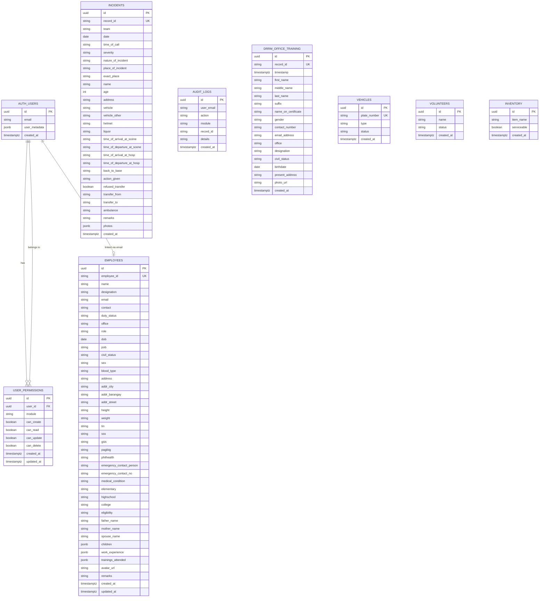
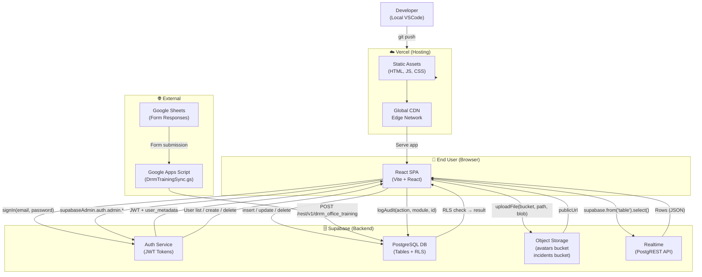
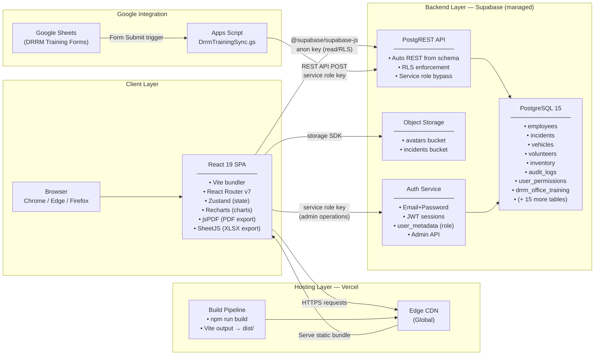
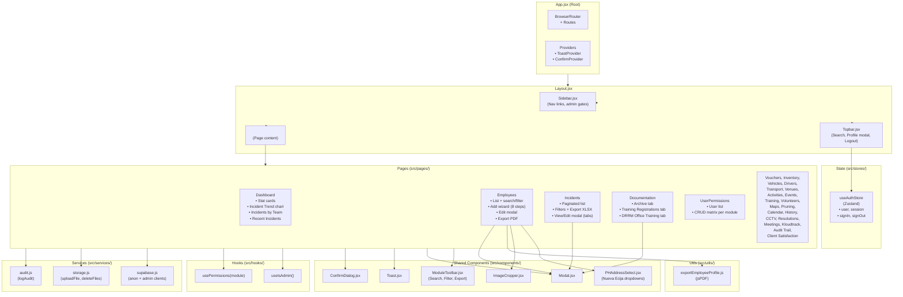
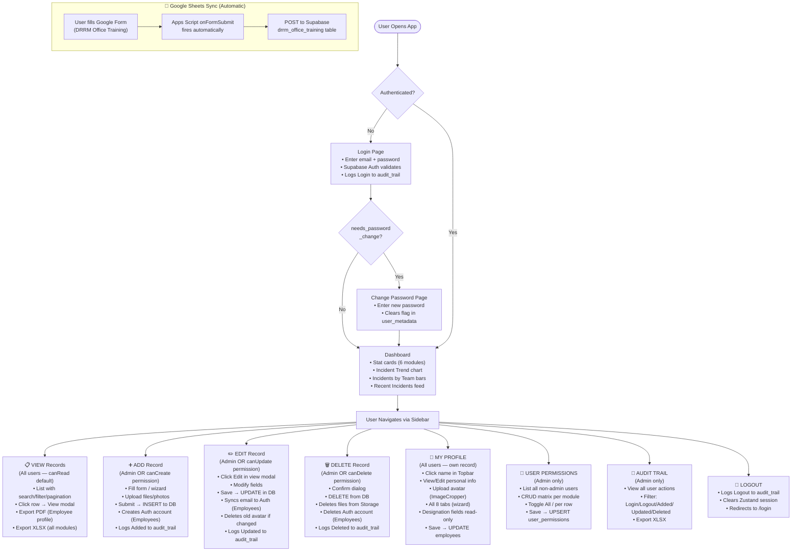

# CDRRMO System — Technical Diagrams

> **How to view:** Open in VS Code with the Markdown Preview Enhanced extension, or paste Mermaid blocks at [mermaid.live](https://mermaid.live).

---

## 1. Entity Relationship Diagram (ERD)

Shows all Supabase tables, their columns, and relationships.

---

## 2. Data Flow Diagram (DFD)

Illustrates how data moves between the React frontend, Supabase backend, and Vercel.

---

## 3. System Architecture Diagram

High-level view of all system components and how they connect.

---

## 4. Component Diagram

Maps React components, pages, and their interactions.

---

## 5. Workflow / Use Case Diagram

Defines all user actions and their flows through the system.

---

## Summary Table

| Diagram | Purpose | Format |
|---|---|---|
| ERD | Database schema & relationships | Mermaid `erDiagram` |
| DFD | Data movement across layers | Mermaid `flowchart TD` |
| System Architecture | Component topology & tech stack | Mermaid `flowchart LR` |
| Component Diagram | React component tree & dependencies | Mermaid `flowchart TD` |
| Use Case / Workflow | User actions end-to-end | Mermaid `flowchart TD` |

> **Rendering tip:** All diagrams use [Mermaid](https://mermaid.js.org/) syntax. Install the **Markdown Preview Mermaid Support** extension in VS Code to render them inline.
